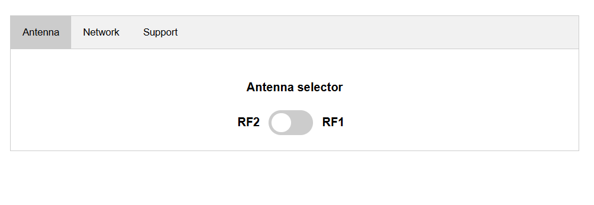
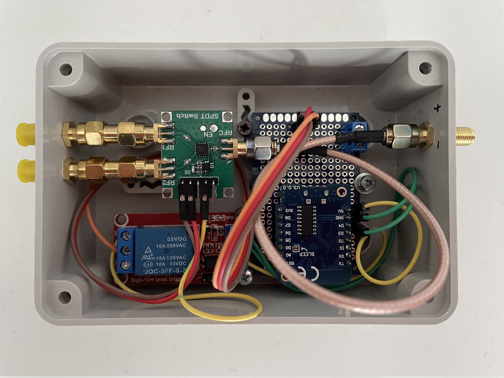

# Remote Antenna Switch

## Description

This project is a remote antenna switch based on the ESP8266 microcontroller. The device allows users to control an RF switch via a simple web interface.

Initially, the ESP8266 starts in Access Point (AP) mode, allowing users to configure WiFi credentials along with the network settings.

Once configured, it switches to Station mode and connects to the specified network. The web interface provides an easy way to control the relay, which in turn operates an HMC349 RF switch module.

Additionally, the project can be integrated with OpenWebRX, allowing users to switch antennas directly from its interface. This is made possible by utilizing a custom API implemented on the ESP8266 to control the relay.

The current setup uses a single RF switch, enabling selection between two antennas (RF1 and RF2). However, additional antennas can be controlled by adding more modules and relays.

_WEB UI to control the antenna switch_

## Bill of Materials (BOM)

- ESP8266 Wemos D1 Mini.

- 5V One Channel Relay Module Relay Switch with OPTO Isolation.

- HMC349 RF Switch Module.

- Enclosure (optional) - A 120 × 80 × 50 mm box was used..

- Jumpers & Connectors.

These components are readily available from online marketplaces like Amazon and AliExpress.

## Wirings

The Wemos D1 Mini is powered using 5V via the VIN pin.

The D3 pin is connected to the IN pin of the relay, acting as the control pin.

The HMC349 RF Switch requires 5V power and toggles between RF1 and RF2 when 5V is applied to the VCC control pin.

## Features

- WiFi Configuration: AP mode for initial setup, then switches to Station mode.

- Web Interface: Simple and intuitive UI for controlling the relay.

- Secure and Reliable Switching: Uses an optoisolated relay for safe operation.

- RF Switching: Integrates an HMC349 RF switch module for antenna switching.

- OpenWebRX Integration: Allows antenna switching from within OpenWebRX using the ESP8266 API. See https://github.com/mnoalett/owrxantswitcher

- Custom API for Control: Provides an API for external applications to get and set the relay state.

- mDNS Support: The device announces itself on the network using mDNS, allowing access via a hostname. The mDNS name is generated dynamically as http://antswitch-XXXX.local, where XXXX corresponds to the last two bytes of the ESP8266's MAC address. This eliminates the need to manually find the device's IP address.

## API Endpoints

The ESP8266 exposes a simple API for integration:

- **(GET) `/api/relay`:** Retrieves the current relay status.
  - Response: `{ "relay_status": "on" }` or `{ "relay_status": "off" }`
- **(POST) `/api/relay`:** Sets the relay state.
  - Body: `{ "state": "on" }` or `{ "state": "off" }`
- **(GET) `/api/config`:** Gets the network configuration, and software version

- **(POST) `/api/config`:** Updates the network configuration.

- **(DELETE) `/api/config`:** Delete the current network configuration, causing the device to restart in Access Point mode.

This API allows OpenWebRX and other external applications to dynamically control the antenna switch.

## OpenWebRX Integration

You can find the modified OpenWebRX antenna switch plugin at https://github.com/mnoalett/owrxantennaswitcher

##
